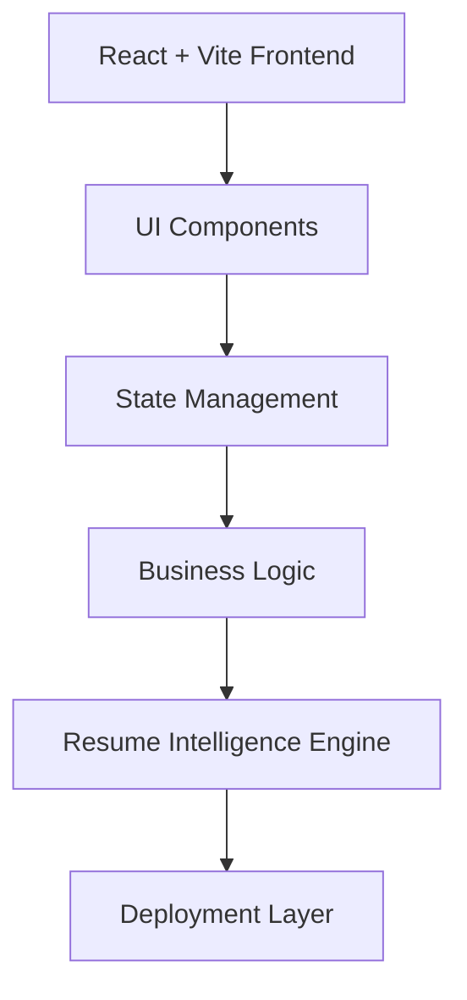
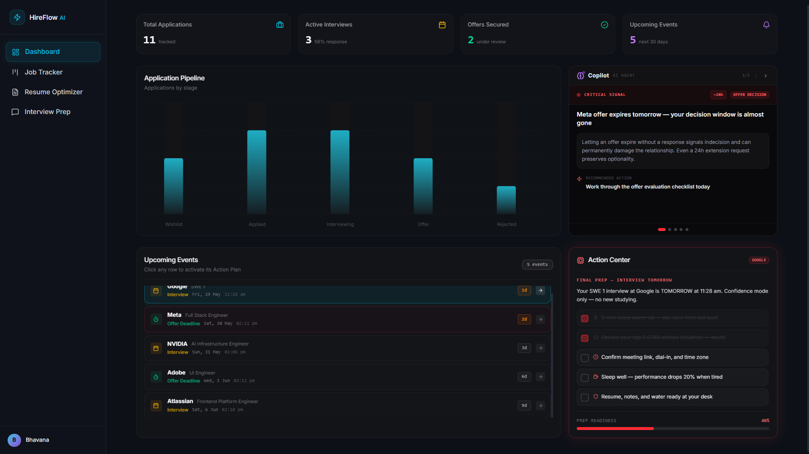
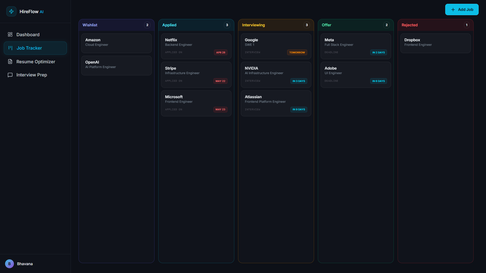
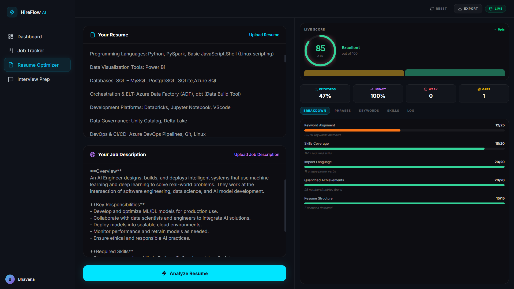
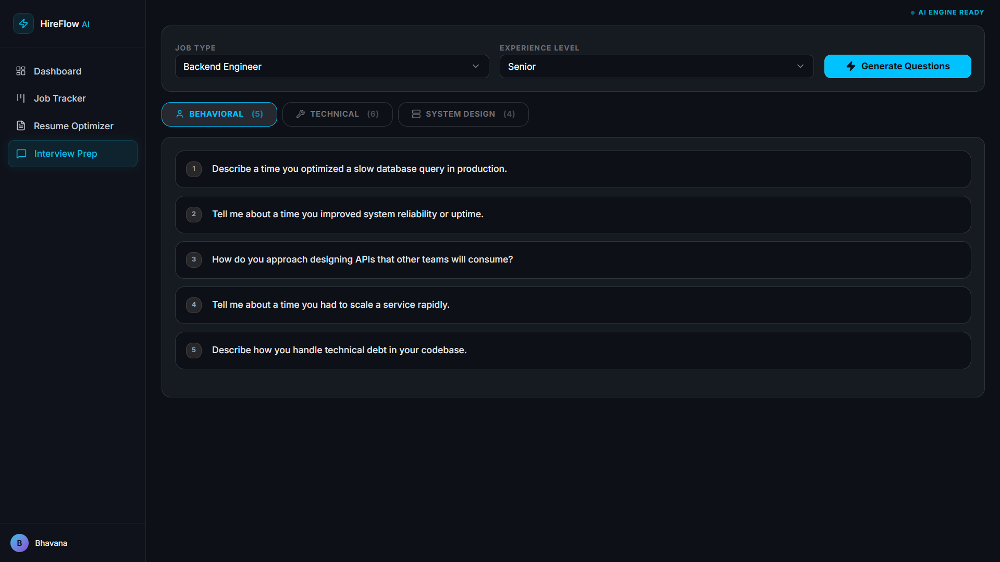

# HireFlow AI

### AI-Powered Career Workflow Management Platform

> HireFlow AI transforms fragmented job searching into a unified workflow system for application tracking, resume optimization, and interview preparation.


---

# Overview

Modern job searching often requires switching between multiple disconnected tools such as spreadsheets, resume analyzers, interview preparation platforms, and personal notes.

HireFlow AI centralizes these workflows into one intelligent platform that helps users manage applications, optimize resumes, prepare for interviews, and track career progress efficiently.

---

# Quick Preview

### Dashboard Analytics

Centralized dashboard for tracking applications, interviews, and upcoming events.

### Job Tracking System

Kanban-style workflow for managing job applications across multiple stages.

### Resume Optimizer

AI-assisted ATS analysis workflow with resume improvement suggestions.

### Interview Preparation

Generate role-specific interview questions dynamically.

---

# Problem Statement

Candidates often struggle with:

* Disorganized application tracking
* Poor visibility into application progress
* Manual interview preparation workflows
* Resume optimization challenges
* Scattered information across multiple platforms

This leads to inefficient workflows and missed opportunities during job searching.

---

# Solution

HireFlow AI provides a unified career workflow platform that allows users to:

* Track job applications efficiently
* Optimize resumes for ATS systems
* Prepare dynamically for interviews
* Monitor upcoming events and deadlines
* Analyze career progress through dashboards

---

# Project Highlights

* Built scalable modular frontend architecture
* Designed responsive dark-themed dashboard UI
* Implemented drag-and-drop workflow tracking
* Integrated AI-assisted resume analysis workflows
* Created reusable component-driven systems
* Optimized rendering performance for dynamic updates

---

# Core Modules

---

## Dashboard Analytics

Centralized analytics dashboard providing real-time career visibility.

### Features

* Application pipeline visualization
* Active interview monitoring
* Upcoming events tracking
* Action center recommendations
* Analytics overview

### Engineering Focus

* Reactive rendering
* Optimized component updates
* Modular dashboard architecture

---

## Job Tracking System

Kanban workflow for application management.

### Pipeline Stages

* Wishlist
* Applied
* Interviewing
* Offer
* Rejected

### Features

* Drag-and-drop workflow transitions
* Add/Edit application details
* Match score tracking
* Notes management

---

## Resume Optimization Engine

AI-assisted resume analysis workflow.

### Features

* Resume upload
* Job description analysis
* ATS compatibility checking
* Skill gap detection
* Resume improvement recommendations

---

## Interview Preparation Engine

Role-specific interview preparation workflow.

### Features

* Role selection
* Experience-level customization
* Dynamic practice question generation

### Supported Roles

* Software Engineer
* Cloud Engineer
* Frontend Engineer
* Backend Engineer
* Data Engineer

---

# Architecture



---

# Technical Stack

## Frontend

* React
* TypeScript
* Vite
* Tailwind CSS
* Framer Motion

---

## Backend

* Node.js
* Express

---

## Database

* PostgreSQL
* Drizzle ORM

---

# Performance Optimizations

* Lazy-rendered modules
* Memoized computations
* Reduced unnecessary re-renders
* Optimized UI lifecycle handling
* Efficient state synchronization

---

## 📸 Screenshots

### 🖥️ Intelligent Dashboard
*Architected a high-level command center visualizing real-time application analytics, AI-driven 'Critical Signal' monitoring, and readiness tracking.*


---

### 📋 Kanban Job Tracker
*End-to-end lifecycle management. A cinematic drag-and-drop interface to manage high-volume applications across complex hiring funnel stages.*


---

### 📄 AI Resume Optimizer
*Leveraging LLM-powered analysis to provide instant ATS scoring, keyword alignment, and deep-dive skills coverage for targeted roles.*


---

### 🤖 AI Interview Prep
*Generating context-aware behavioral, technical, and system design questions tailored to specific seniority levels and job descriptions.*


---
---

# Current Capabilities

* Dashboard analytics
* Job application tracking
* Resume optimization workflow
* Interview preparation system
* Modular scalable architecture
* Responsive modern UI system

---

# Challenges Solved

## Cross-Module State Synchronization

Implemented seamless updates across dashboard analytics and workflow data.

---

## Performance During Dynamic Updates

Optimized rendering logic for smooth and responsive interactions.

---

## Modular Design

Structured the application for independent feature scaling and maintainability.

---

# Future Roadmap

## AI Enhancements

* Resume rewriting assistance
* Semantic job matching
* Intelligent recommendations
* Career insights generation

---

## Platform Enhancements

* Authentication system
* Persistent cloud database
* Multi-user support
* Team collaboration workflows

---

# Deployment

## Local Development

Clone repository:

```bash
git clone https://github.com/bhavana-cloudworks/hireflow-ai.git

cd hireflow-ai

pnpm install
```

Run frontend:

```bash
cd hireflow

pnpm dev
```

Run backend:

```bash
cd api-server

pnpm dev
```

---

## Production Build

```bash
pnpm build
```

---

# Deployment Status

Frontend deployment and backend integration are currently being finalized.

The project is fully functional in local development environments.

---

# Author

## Bhavana

Cloud & AI Engineer | Systems Builder

